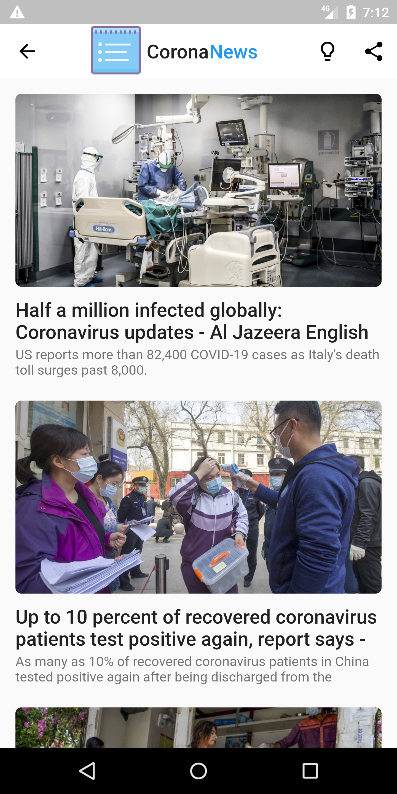

# tojuwa

Corona tracking application built with flutter

[](https://github.com/Mastersam07/toju_wa/pulls)


> This app is under development
>
>

## Demo
Download the `apk-release.apk` to try out Flutsapp
<br>
<a href="#"></img></a>
<br>

## 💻 Requirements
* Any Operating System (ie. MacOS X, Linux, Windows)
* Any IDE with Flutter SDK installed (ie. IntelliJ, Android Studio, VSCode etc)
* A little knowledge of Dart and Flutter
* Hands to code 🤓
* A brain to think 🤓

## ✨ Features
- [x] Global Cases
- [x] Country Specific Cases(Nigeria as case study)
- [x] Precautionary Measures
- [x] Covid-19 Latest News
- [ ] Statistics and trends
- [ ] Helpline


## 📸 ScreenShots


|||
|||

## 🔌 Plugins
| Name | Usage |
|------|-------|
|[**Http**](https://pub.dev/packages/http)| Api Calls|
|[**Cached Network Image**](https://pub.dev/packages/cached_network_image)| To display images from web|
|[**Webview Flutter**](https://pub.dev/packages/webview_flutter)| Display news in webview|

## Dependencies
* [Flutter](https://flutter.dev/)

## Getting started

#### 1. [Setup Flutter](https://flutter.dev/docs/get-started/install)

#### 2. Clone the repo

```sh
$ git clone https://github.com/Mastersam07/toju_wa.git
$ cd toju_wa/
```

#### 3. Get your open news api key

#### 4. Create the file apiKey.dart in your lib folder and enter the code below:
 
```sh
String apiKey = "Your_Api_Key";
```

#### 5. Run _flutter pub get_

## What's Next?
 - [ ] Statistics and trends
 - [ ] Helpline
 
## 🐛 Bugs/Request
#### Encounter any problem(s)? feel free to open an issue. If you feel you could make something better, please raise a ticket on Github and I'll look into it. Pull request are also welcome.

## ⭐️ License
#### <a href="https://github.com/Mastersam07/toju_wa/blob/master/LICENSE.md">MIT LICENSE</a>

## 🤓 Developer(s)
**Abada Samuel Oghenero**
